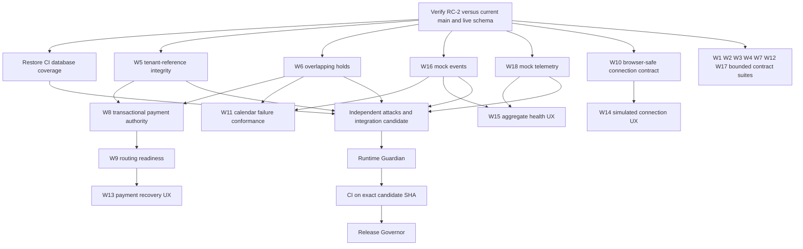

# Booking Lumin continuation program

## Foundation and activation boundary

Accepted RC-2 foundation: `6bbcd679a09741d3a2e978ddd2bb398f1d98a6f9`, conditional acceptance. Observed remote main on 2026-09-08: `e5f8ebad0f8975e967c6be167ee324d9ce3a96b9`. These are different states. Preserve all accepted migrations 0001–0009 and B1–B6 / R1–R9 in BASELINE_INVARIANTS.md. Do not reset main to RC-2 or silently certify subsequent work as live.

Read-only live inspection: project `pplwyfbxrnodimhzlvdl` ACTIVE_HEALTHY; migrations 0001–0009; 27 public tables with RLS enabled and forced. Customer/booking SELECT policies remain tenant-member-only; secret tables have no policies. No live writes were performed. Auth HTTPS transport certification (RUNTIME-04) and residual financial/audit raw access (RISK-4) remain open.

Remote main CI run 34279925250 succeeded. Main reports protected=false and rulesets=[]; protection-detail access returns 403. Session GitHub permissions: pull=true, push=false, admin=false. The documented rc2-clean-runtime-baseline tag is absent in the fetched repository; use the exact commit above. Never claim settings are enforced by this document.

Existing open scheduling PR #27 at `79239acf6e4c18fb03949a2a0581d7c26f19313c` owns contracts/core availability and scheduling tests. Reconcile it before dispatching W4 changes; this batch neither changes its paths nor merges it.

All new work uses local isolated branches, mocks, synthetic fixtures and disposable databases. No provider credential, OAuth grant, production connection, deployment, live migration or external notification is authorized. Provider keys are the final activation step, followed by provider-specific certification; key entry alone is not certification.

## Organization and scheduling

The six governor roles are accountable checkpoints, not a claim that six independent agents are always running. This session has four concurrent agent slots: coordinating governor plus up to three builder/reviewer cells. Persist the 18 domain queues below and rotate cells according to dependencies. Reviewers must not approve code they built. Security/adversarial cells operate across all queues; they are separate from the 18 canonical domains.

Program Governor owns priorities and this DAG. Architecture Governor freezes shared interfaces. Security Governor can block unsafe scope. Integration Governor alone combines commits, updates workspace lockfiles and allocates migrations. Runtime Guardian checks accepted invariants and prevents live drift. Release Governor prohibits promotion without exact-candidate CI and evidence.

Shared contracts, root lockfile and CI have one integrator. No concurrent edits to those files. Migrations 0013 and 0014 are allocated to tenant-reference integrity and overlap serialization respectively. Previously accepted migration files are immutable. A future migration may fail safely on inconsistent data; it must not delete or silently repair it.

## Persistent workstream queue

These are continuation tasks over existing implementations, not duplicate implementations. PLANNED means queued, not a running agent. REVIEW means builder work exists and is undergoing independent gates.

| ID | Domain | Next bounded increment | Exclusive builder paths | Dependency / initial state |
|---|---|---|---|---|
| W1 | Core Domain Engine | Payment/booking contract conformance and invalid selection boundaries | packages/core/test/continuation.test.ts | Payment-authority remediation contract; PLANNED |
| W2 | Service Template Engine | Versioned template references to workflow and resources | packages/templates/src/validation.ts; test/validation.test.ts | Architecture contract freeze; PLANNED |
| W3 | Workflow / Question Engine | Depth/cycle limits and stale hidden pricing effects | packages/workflow/src; packages/workflow/test | W2 reference contract; PLANNED |
| W4 | Scheduling Engine | DST and interval boundary conformance | packages/core/test/scheduling-boundaries.test.ts | W6 authority and PR #27 reconciliation; PLANNED |
| W5 | Resource / Rental Engine | Enforce tenant relationships; later quantity-aware allocation | supabase/migrations/0013_resource_tenant_integrity.sql; supabase/tests/resource_tenant_integrity_tests.sql | Tenant integrity independent PASS; allocation PLANNED |
| W6 | Capacity Hold + Concurrency | Different-start/timezone overlapping reservation serialization | supabase/migrations/0014_capacity_serialization.sql; supabase/tests/capacity_overlap_concurrency_harness.sh | Independent review PASS; no live apply |
| W7 | Platform Billing | Tenant-bound subscription retry conformance | packages/billing/test/continuation.test.ts | Separate BillingProvider retained; PLANNED |
| W8 | Merchant Payments | Transactional authoritative confirmation and durable webhook retries | supabase/functions/stripe-webhook; future migration allocated centrally | W5/W6 and reviewed transaction contract; BLOCKED for activation |
| W9 | International Payment Routing | Tenant connection readiness separate from advertised capabilities | packages/payments/src/readiness.ts; test/readiness.test.ts | W8 contract; PLANNED |
| W10 | Identity + OAuth Connections | Browser-safe DTO and fake connect/reconnect/revoke flow | packages/integrations/src/client.ts; test/client.test.ts | Server crypto stays out of browser; PLANNED |
| W11 | Calendar Adapters | Fake outage, stale busy state and replay conformance | packages/integrations/test/calendar-conformance.test.ts | W6 and W16; PLANNED |
| W12 | Media / HD Image Engine | Bounded fake transform jobs and tenant object ownership | packages/media/src/jobs.ts; test/jobs.test.ts | Security limits review; PLANNED |
| W13 | Customer Checkout UX | Pending/unknown payment recovery without false confirmation | apps/checkout/src/steps/Payment.tsx; Payment.test.tsx | W8/W9; PLANNED |
| W14 | Business Portal | Interactive explicitly simulated provider connections | apps/portal/src/pages/Integrations.tsx; data/mockConnections.ts; tests | W10; PLANNED |
| W15 | Lumin Command Center | Aggregate delivery/health views without raw payloads | apps/command-center/src/pages/Health.tsx; Health.test.tsx | W16/W18; PLANNED |
| W16 | Realtime + Event System | Bounded tenant mock delivery and duplicate/retry isolation | packages/realtime/** | REVIEW; no production transport |
| W17 | Internationalization | Malformed locale/currency/timezone and DST fixtures | packages/i18n/test/boundaries.test.ts | Independent test slice; PLANNED |
| W18 | Observability + Platform Health | Strict allowlisted tenant mock aggregates | packages/observability/** | Independent re-review PASS after frozen-allowlist fix; no production collector |

Paths abbreviated as test/ are relative to that row's package. Assign exact full paths at dispatch. No builder may broaden ownership without replanning.

## Dependency DAG

The table is authoritative for internal dependencies within the grouped conformance-suite box (W3 waits on W2; W4 waits on W6). W8 does not need to finish for isolated leaf mocks to be reviewed. It does block any real payment/resource activation. Downstream app wiring waits for reviewed leaf contracts. Do not release an incomplete product flow just because leaf package tests pass.

## Required evidence loop

Builder → Unit Test → Domain Review → Independent Review → Adversarial Test → Integration Governor → Runtime Guardian → CI → Release Governor.

Record SHA, reviewer, commands/results and outstanding limitations for each gate. Failed gates return to the owning builder. Fixes invalidate affected downstream evidence. Never skip/quarantine tests or call local results remote CI. Review/adversarial test authors must be independent of the builder. Separate role checkpoints may share a reviewer only with that fact recorded; do not invent independent signoffs.

No direct experimental work on main. Read-only remote access blocks PR publication and candidate CI, not isolated development. Release remains BLOCKED until write access is available, all required checks pass on the exact candidate and review evidence is complete. Branch protection must require the actual verify/database check names, a PR review and no force pushes/deletions; an owner must configure it because this connection lacks administration rights.

## Open authority findings

Static audit additionally found non-atomic webhook hold-consume/confirmation, ignored resolved database errors, payment event-order regressions, missing quantity-aware resource integration, and the existing refund-idempotency limitation. These are not closed by 0013/0014 or mock packages. Reproduce with fake-provider fault injection, define an atomic authority RPC and rerun independent attacks before activation. The legacy contamination check is not a comprehensive secret/PII scanner. Record each finding rather than treating successful CI as complete runtime certification.
