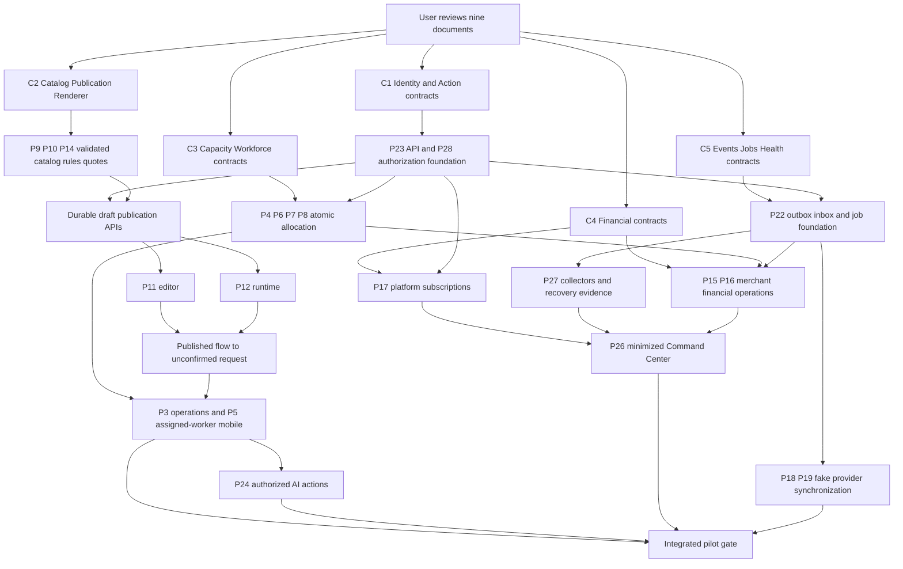

# Backend dependency DAG

**Status: PROPOSED — pending user review of the complete nine-document master product package.**

This is an architecture and sequencing proposal, not deployment or migration authorization. All implementation queues remain PROPOSED. Audit snapshot: `fb98a7b9feaadb429ca7656430590d790d394a1a` in `C:/Users/fligh/Documents/Codex/2026-09-08/continue-the-booking-lumin-checkout-engineering/work/repo`. Evidence paths below are relative to that root. Accepted RC-2 is separately pinned at `6bbcd679a09741d3a2e978ddd2bb398f1d98a6f9`; preserve its B1–B6/R1–R9 invariants. Current protection/CI facts do not certify new functionality or hosted runtime health.

## 1. Current architecture and reuse boundary

| Existing asset | Reuse | Gap before target behavior |
|---|---|---|
| `packages/contracts`, `packages/core` | Tenant/service/booking/selection contracts; pure price and availability logic | Booking record lacks immutable published workflow and quote snapshot linkage; proposed roles/actions require explicit contracts. |
| `packages/templates`, `packages/workflow` | Service presets, serializable question/condition/effect evaluation | Durable draft/publication lifecycle, field registry, version compatibility and shared editor/runtime renderer. Effects select price inputs; they must not invent authoritative totals. |
| `packages/resources`, migrations 0010–0014 | Resource planning, capacity holds, composite tenant integrity, stable carrier locking | Atomic combined service/resource/worker/crew quantity reservation and production caller integration remain separate work. |
| `packages/billing`, `packages/payments` | Separate platform BillingProvider and richer MerchantPaymentProvider contracts; mocks and capability routing | Durable billing ledger/entitlements, bridge to current minimal payment adapter, tenant connection readiness and certified real providers. |
| `packages/integrations` | Server-side OAuth state/PKCE/vault abstraction, mock calendar adapters | Durable connections, background sync, provider callbacks and authenticated reconnect UX. Server crypto modules must not enter frontend bundles. |
| `packages/media` | Tenant asset/variant/storage contracts and pure transform planning | Authoritative Storage policies, safe uploads and actual bounded image processing jobs. |
| `packages/realtime`, `packages/observability` | In-memory retry/deduplication and allowlisted metric/status primitives | Durable outbox/inbox, tenant authorization, production collectors, recovery and actual health evidence. |
| `packages/runtime-client`, app `connected` components | Narrow Supabase public/authenticated fetch adapter; catalog and unconfirmed draft transport | Full shared app shells, complete authorized operations, worker experience, Render API and Action API. |
| Supabase functions | Existing repricing, payment intent and verified webhook flow | Known non-atomic finalization/error/reorder/quantity risks must be reproduced and closed; additive 0013/0014 do not close them. |

Connected checkout currently creates an unconfirmed draft with no capacity reservation or payment. Connected portal offers narrow authenticated reads/service updates. Connected Command Center reads four aggregates through a separate component, while its richer five-route UI is mock-backed. None establishes the new product as implemented. No current Render host, worker app or durable transactional outbox was found in this audit.

## 2. Proposed runtime ownership

| Platform | Responsibility | Boundary |
|---|---|---|
| Netlify | Customer checkout/embed, Business Portal, private Command Center, proposed assigned-worker mobile frontend (`apps/worker`, `/worker`) | Static/frontend delivery and deployment provenance. Browser has public configuration and the user's scoped session only; never provider secrets or privileged database keys. |
| Render web API | Verified authorization context; workflow/booking orchestration; Action API; provider callback ingress; health endpoints | Stateless application layer calling narrowly authorized authoritative transactions. An API process or cache is not the reservation or money ledger. |
| Render background workers/jobs | Durable queue consumers, provider retries, image variants, reconciliation, notifications, calendar sync, aggregates | Bounded leases/retries and idempotent effects. HTTP callback ingress belongs to web API, not a worker without inbound traffic. |
| Supabase | Authoritative Postgres transactions/constraints/RLS, Auth identity, Storage assets, authorized Realtime delivery | Persist state and audit/outbox atomically; validate tenant/nested relationships at the database boundary. Realtime transport does not replace durable event history. |

Render distinguishes web/private services from continuously running background workers; workers consume queued work rather than accept public HTTP. [Render background workers](https://render.com/docs/background-workers), [private services](https://render.com/docs/private-services).

An optional Netlify Function/edge proxy may handle a bounded frontend concern after a separate need is demonstrated. It must not become a second booking writer, durable queue, payment finalizer or long-running orchestration authority. A Netlify background function's asynchronous acceptance is not business completion. The initial proposal therefore keeps asynchronous domain work on Render. [Netlify background functions](https://docs.netlify.com/build/functions/background-functions/).

Field workers are people with assigned jobs; Render workers are computing processes. Use different API nouns, permission models and health labels.

## 3. Contract freeze removes apparent cycles

The implementation graph becomes acyclic by reviewing small shared contracts before parallel builders consume them. Contract definition is a joint architecture checkpoint, not two builders waiting for each other's implementation.

| Contract checkpoint | Producers and consumers | Minimum frozen content |
|---|---|---|
| C1 Identity/actions | P28/P23 with P3/P4/P5/P24/P25/P26 | Verified actor, tenant membership, platform role, worker assignment scope, capability checks, request ID, idempotency key, expected version, stable error model. Client tenant IDs are inputs to validate, never authority. |
| C2 Catalog/publication/rendering | P9/P10/P11/P12/P14/P21 | Stable service/field/rule IDs, typed answers, conditional dependency validation, public projection, renderer contract, immutable publication reference and schema version. |
| C3 Capacity/workforce | P4/P6/P7/P8 with P3/P12 | UTC interval, tenant IANA timezone, quantity, buffers, resource/crew members, eligibility, lease/expiry and atomic reservation outcome. |
| C4 Financial boundaries | P14/P15/P16/P17 | Minor-unit amount/currency, immutable quote lines, deposit versus full price, invoice allocation, normalized payment events; separate platform subscription entities and merchant settlement entities. |
| C5 Events/jobs/health | P22/P23/P27/P28 | Event ID/schema version/tenant/entity version, outbox/inbox/job state, redacted payload, retry and reconciliation rules, source timestamp/freshness/readiness dimensions. |

C2 explicitly resolves P11 ↔ P12: agree Publication and Renderer interfaces first; then builder editor and runtime renderer proceed in parallel against fixtures, followed by one integration slice. Similarly C2 resolves P9/P10/P14 and C3 resolves P4/P7/P8. P22/P23/P27 share C5 before implementing transport, workers or collectors.

## 4. Dependency DAG and executable waves

The diagram summarizes critical dependencies; the table specifies supporting work and release order. A dependency refers to a reviewed contract or implemented capability as stated, not completion of an entire broad workstream.

| Wave aligned to MIGRATION_PLAN | Ready work | Exit before dependent release |
|---|---|---|
| Phase 0: review | P1 and governors reconcile nine documents; no implementation | User review and recorded decisions. |
| Phase 1: foundations | C1–C5; P23/P28 authenticated API skeleton; publication persistence; P22 durable event/job foundation; P27 definitions; worker/resource schemas | Contract fixtures, additive DB plan, auth attacks and compatible transaction boundaries. Event/job foundation must be ready before phase 5; it is not deferred wholesale to phase 6. |
| Phase 2: shared surfaces | P25 route/data-adapter shell, P2 dashboard DTO, P21 locale fixtures, P26 authorized/mock route shell | Existing paths preserved and source labels honest; shell work does not unlock production data. |
| Phase 3: builder/request | P9/P10/P11/P12/P14 using C2; P13 bounded media metadata and upload policy | Publish immutable cleaning/detailing fixtures; checkout pins version, validates and persists unconfirmed request. Durable transforms require job foundation. |
| Phase 4: operations | P3/P4/P5/P6/P7/P8; P20 replaceable navigation links | Atomic scarce-capacity and worker permissions; rental quantity, crew collision, DST and reconnect evidence. |
| Phase 5: neutral providers/finance | P15/P16/P17/P18/P19; event consumers and reconciliation | Fake payment completion, invoice allocation, tenant-bound OAuth mocks and safe retries; no real connection activation. |
| Phase 6: platform/pilot | P24 Action API façade, P26 actual aggregates, P27 measurements; P22 recovery/load certification | Complete journeys, exact-candidate CI, real authenticated isolation and resolved risks for pilot scope. |
| Phase 7: separately authorized activation | Provider-specific credentials and controlled expansion | Separate explicit authorization, certified staging behavior and provider-specific rollback/reconciliation. |

With four active agent slots, schedule coordinator plus three bounded cells; rotate independent reviewers. Persist 28 queue records without claiming 28 simultaneous agents. Shared manifests, contracts, migration numbering, central routers and combined integration belong to the Integration Governor. Exact files and base SHA are allocated at dispatch; builders use isolated branches/worktrees.

## 5. Authoritative transaction and Action API rules

Proposed operations are `findAvailability`, `getBooking`, `reschedule`, `cancel`, `assignWorker`. Both human clients and the AI adapter call the same authorized Action API. AI receives minimized results; it cannot issue SQL, choose arbitrary tenants, invoke provider credentials or bypass confirmation requirements. Mutating actions require validated scope, operation permission, idempotency and state/version preconditions. An AI interpretation is a proposal until required user confirmation and server validation succeed.

Reads apply tenant/assignment scope and bounded pagination. An availability response is an expiring offer, never a guarantee. Writes re-evaluate authoritative rules in a short database transaction. Rescheduling retains the previous committed reservation if replacement allocation fails; resource/worker/crew changes validate all members and quantities atomically. Customer browser timezone is display context: tenant IANA timezone controls local business hours, UTC instants control comparisons, and DST gaps/folds must be explicit.

Normal tenant reads and actions use the verified caller-scoped database/JWT context or a narrowly granted, reviewed RPC that preserves database authorization. Render must not become a generic service-role table proxy: server-side filters do not replace RLS. Privileged service-role use is limited to explicitly designated payment/background operations with validated tenant relationships and narrow audited commands. AI receives neither a service key nor a generic database interface.

Use one transaction RPC per coherent transition, writing booking/hold/financial linkage/audit/outbox together where required. Provider network calls remain outside database locks. Persist an intent, invoke the provider idempotently, then finalize or enqueue durable reconciliation through a second validated transaction. Do not pretend distributed payment and database effects are one ACID transaction. Duplicate, reordered and late callbacks must not regress successful state or allocate a second reservation.

Keep public draft creation a separate limited capability. Existing connected preview drafts must not become confirmed bookings through a migration, configuration switch or retry. Preserve existing authoritative repricing and confirmation rules until a reviewed replacement has equivalent and extended proof.

## 6. Publication, quotes and public embed boundaries

A mutable flow draft has an owner, tenant, revision and validation report. Publish creates an immutable workflow/configuration snapshot with a schema version, service/rule references, locale behavior and safe public projection. A published alias points new sessions to an approved immutable version; an existing checkout session and resulting booking retain their pinned version. Historical answers and price explanations remain interpretable after edits.

Public runtime resolves tenant authority server-side from installation → flow → published version. Session, quote, hold, upload and payment commands bind that tuple and reject client tenant/version substitution; host-origin permission supplements this binding, not tenant authorization.

The renderer consumes that same projection in preview and installed runtime. Draft preview is explicitly marked and isolated from production actions. Arbitrary executable user scripts/HTML do not become workflow rules. Conditions/effects have size/depth limits, invalid dependency/cycle checks and hidden-answer cleanup semantics. Server validation rejects forged field IDs and effects outside the publication.

Quotes are server-derived from accepted inputs and pricing rules, with currency, line items, tax/fee/deposit policy, expiry and immutable version/hash. Client totals are never accepted as authority. Requote/reconfirm policy must be explicit when price changes; published-flow rollback cannot rewrite old booked prices. Canonical builder routes are `/portal/embed/flows/:flowId/{steps,fields,design,pricing,availability,payment,tracking,preview,install,publish}`. Resource inventory lives at `/portal/services/resources`; its allocation view at `/portal/calendar/resources` references the same records.

## 7. Events, providers and storage

A committed business transition appends a tenant-scoped event to an outbox in the same transaction. Render consumers claim bounded leases, acknowledge only after durable effects, retry with bounded backoff and place exhausted jobs into an inspectable dead-letter/reconciliation state. Consumers deduplicate by event/effect identity; delivery is at least once, not an exactly-once promise. Provider webhook inboxes verify signatures and deduplicate before normalized transitions.

Realtime carries authorized, minimized notifications or read-model changes. Private channel membership derives from verified tenant/assignment authorization, never an untrusted topic string. Reconnect uses an authorized cursor/read API to recover missed changes and reject revoked access; logout/role changes discard stale responses. Supabase Realtime authorization uses RLS at channel join, and its authorization table is not event persistence. Therefore durable recovery and revocation behavior require explicit application tests. [Supabase Realtime authorization](https://supabase.com/docs/guides/realtime/authorization).

Merchant capability routing combines country/currency/method requirements with the tenant's verified connected account and current readiness. A provider being listed in a registry does not make it usable. Platform BillingProvider manages what businesses pay Lumin; MerchantPaymentProvider manages customer-to-business payments. Keep events, credentials, invoices, permissions and ledgers distinct. Merchant GMV/refunds/AOV are not Lumin MRR/ARR or settled platform revenue.

OAuth tokens and provider secrets remain server-side. Calendar sync reflects authoritative booking events; provider calendars cannot silently overwrite internal reservations. Email/SMS use redacted event projections and fake delivery until final activation. Maps start with replaceable navigation links; precise customer location is scoped to authorized operational need.

Supabase Storage holds tenant-owned originals and derived variants under explicit policies. Public marketing media and private job evidence are different asset classes; private evidence requires authorized time-limited access. Validate size/type/decode limits, remove unsafe metadata where appropriate and run bounded processing on Render. Local service disks and frontend caches are not durable asset authority.

## 8. Proposed scale and recovery acceptance plan

These are **proposed synthetic workloads and initial engineering budgets, not measured capacity, SLAs or a claim that the current system passes**. Record hardware/service tiers, database version, dataset, index plan and test commit before interpreting results. Adjust budgets through architecture review with evidence, not by silently weakening a failed gate.

| Workload | Proposed test | Proposed acceptance target |
|---|---|---|
| Tenant breadth | Seed 100, then 1,000 synthetic tenants; 100 services and 1,000 bookings each; exercise skewed hot tenants | Tenant read query plans remain indexed and bounded; no cross-tenant rows; report storage/query growth at both sizes. |
| Interactive load | 200 concurrent sessions across 100 tenants for 30 minutes, 80% reads/20% writes; explicitly model request rates | API reads p95 below 500 ms and non-provider writes p95 below 1 s in the declared staging configuration; errors below 1% excluding deliberate validation/conflict responses. |
| Scarce-resource contention | 100 simultaneous contenders for one capacity-1 carrier; repeat pooled and multi-member crew cases | Exactly one valid winner for capacity 1; no oversell, partial reservation or tenant contamination. Conflict latency measured separately from successful actions. |
| Noisy neighbor | One tenant produces 50% of traffic while remaining load is spread across 99 tenants | Per-tenant limits activate; other-tenant p95 latency degradation below 25% versus the same baseline test without the hot tenant. |
| Event burst/recovery | 10,000 synthetic events over 100 tenants; duplicates/reorder; kill/restart consumer during effects | No lost committed event or duplicate business effect; healthy backlog clears within 5 minutes after dependencies recover under declared capacity. |
| Realtime reconnect | 500 clients across 100 tenants; disconnect/revoke/reconnect during updates | Revoked users receive no newly authorized data; cursor recovery converges to authoritative state without trusting missed notifications. |
| Media isolation | 20 concurrent allowed uploads plus oversized/malformed fixtures | Declared memory/time limits enforced; invalid files rejected; one tenant cannot read another tenant's private asset. |

Include authenticated browser/HTTP/RLS tests for owner, staff, proposed manager, assigned worker, platform and anonymous identities; role names are not evidence. Test zero-traffic/unknown/stale health, provider disconnect, queue stalls, expired sessions, replay, malformed nested IDs and schema-version incompatibility. Report latency, throughput, saturation and failure evidence separately; green CI is not proof of actual live service health.

## 9. Migration, compatibility and release gates

Follow MIGRATION_PLAN: inventory live schema first; accepted migrations stay immutable. Additive expansion includes constraints/RLS/transactions, bounded backfill, validated read projections and one authoritative writer. Dirty preflight must fail safely, not silently delete or reparent data. Allocate new migration numbers only after the Integration Governor reconciles repository and live history. Rolling API/worker deployments must accept pending event/configuration versions or explicitly drain them before transition.

Preserve RC-2 invariants and keep RISK-4 raw financial/audit access and RUNTIME-04 full authenticated HTTPS isolation open until their own evidence closes them. Existing hold/payment finalization risks are not resolved by navigation or new hosting. Before pilot, regressions must be reproduced and corrected for the intended scope.

Every slice follows Builder → Unit Test → Domain Review → Independent Review → Adversarial Test → Integration Governor → Runtime Guardian → CI → Release Governor. A failed gate returns to the builder and invalidates affected downstream evidence. Require exact candidate SHA, independent identities, test results, compatibility/rollback plan and bounded release scope. Netlify app rollback cannot undo committed database/payment effects; use compatible API artifacts and durable reconciliation. No direct main experiments, credential connection or provider activation follows from approval of this proposal alone.

## 10. Evidence index

| Claim | Exact repository paths |
|---|---|
| Current domain/state and absent publication linkage | `packages/contracts/src/booking.ts`, `packages/contracts/src/tenant.ts`, `packages/workflow/src/types.ts`, `packages/core/src/pricing.ts`, `packages/core/src/availability.ts` |
| Connected surface limits | `apps/checkout/src/connected/ConnectedCheckout.tsx`, `apps/portal/src/connected/ConnectedPortal.tsx`, `apps/command-center/src/App.tsx`, `apps/command-center/src/connected/ConnectedCommandCenter.tsx`, `packages/runtime-client/src/index.ts` |
| Current public draft RPC and platform aggregates | `supabase/migrations/0007_rls.sql`, `supabase/migrations/0008_command_center_views.sql`, `supabase/migrations/0009_rc2_hardening.sql` |
| Capacity/integrity foundation | `supabase/migrations/0010_capacity_holds.sql`, `supabase/migrations/0012_resources.sql`, `supabase/migrations/0013_resource_tenant_integrity.sql`, `supabase/migrations/0014_capacity_serialization.sql` |
| Current payment flow and residual risk record | `supabase/functions/create-payment-intent/index.ts`, `supabase/functions/stripe-webhook/index.ts`, `docs/CONTINUATION_PROGRAM.md`, `docs/BASELINE_INVARIANTS.md` |
| Payment and provider separation | `packages/billing/src/provider.ts`, `packages/payments/src/contract.ts`, `packages/payments/src/routing.ts`, `packages/integrations/src/oauth.ts`, `packages/integrations/src/calendar.ts` |
| Mock-only media/events/health primitives | `packages/media/src/types.ts`, `packages/media/src/variants.ts`, `packages/realtime/README.md`, `packages/realtime/src/index.ts`, `packages/observability/src/index.ts` |
| Current frontend build packaging | `netlify.toml`, `scripts/build-preview.mjs`, `scripts/preview-mode.mjs` |

The current implementation statements above derive from this repository snapshot. Render, durable jobs/outbox, the Action API, new worker roles and immutable publication persistence remain proposals. Official hosting documentation supports the platform boundary choices, not a claim that any service has been provisioned or connected.

